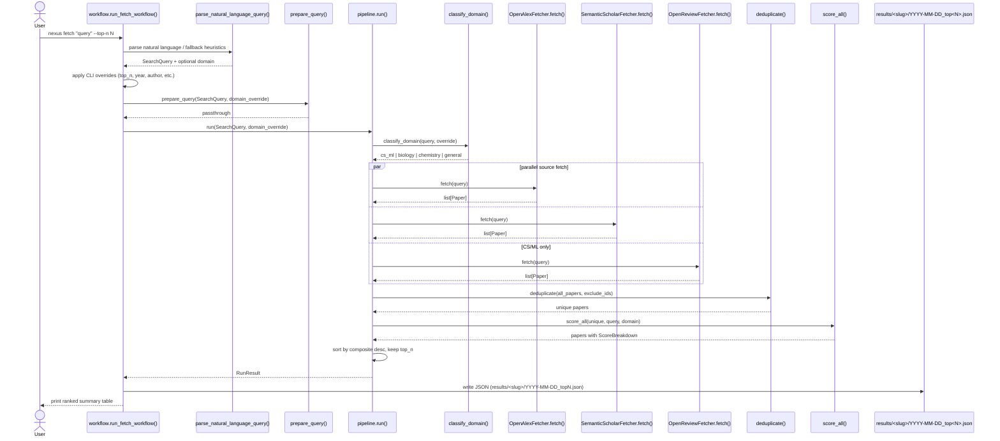
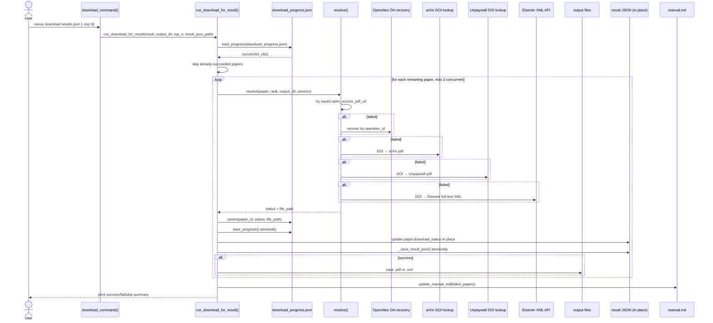
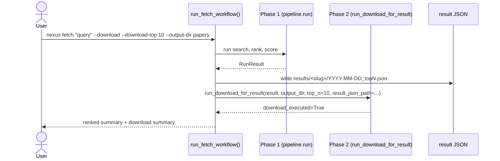
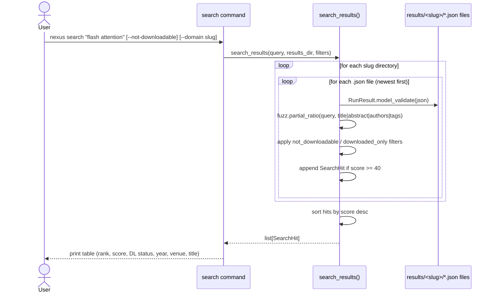

# Nexus Paper Fetcher — Full Workflow

Sequence diagrams and function call graphs for all active runtime phases.

- [Phase 1: `nexus fetch`](#phase-1-nexus-fetch)
- [Phase 2: `nexus download`](#phase-2-nexus-download)
- [Integrated fetch + download](#integrated-fetch--download)
- [Expand-existing search](#expand-existing-search)
- [Internal search: `nexus search`](#internal-search-nexus-search)

---

## Phase 1: nexus fetch

### Sequence diagram



### Function call graph

```text
nexus fetch "query" [flags]
  └─ workflow.run_fetch_workflow(query, top_n, ...)
       ├─ _existing_results_file(query)              # detect if query is a .json path
       ├─ parse_natural_language_query(query)
       │    ├─ if OPENAI_API_KEY: gpt-4o-mini → structured SearchQuery
       │    └─ else: regex heuristics → SearchQuery
       ├─ apply CLI overrides onto SearchQuery
       ├─ _apply_keyword_strategy(SearchQuery, ...)  # sets keyword_count / search_scope
       ├─ prepare_query(SearchQuery, domain_override)  # currently passthrough
       ├─ [expand path] _find_existing_results(query)
       │    └─ load most recent result JSON → exclude_ids
       ├─ pipeline.run(SearchQuery, domain_override)
       │    ├─ classify_domain(query, override)
       │    │    ├─ if override: validate and return
       │    │    ├─ if OPENAI_API_KEY: gpt-4o-mini
       │    │    └─ else: keyword regex fallback
       │    ├─ gather fetchers concurrently
       │    │    ├─ OpenAlexFetcher._fetch(query, client)
       │    │    │    └─ cursor-paginated /works → list[Paper]
       │    │    ├─ SemanticScholarFetcher._fetch(query, client)
       │    │    │    └─ offset-paginated paper/search → list[Paper]
       │    │    └─ OpenReviewFetcher._fetch(query, client)   [cs_ml only]
       │    │         └─ venue-year enumeration → list[Paper]
       │    ├─ deduplicate(all_papers, exclude_ids)
       │    │    ├─ group by normalized DOI → merge groups
       │    │    ├─ cluster DOI-less by fuzzy title ≥ 92 → merge clusters
       │    │    └─ filter out exclude_ids if provided
       │    ├─ score_all(unique, query, domain)
       │    │    ├─ VenueScorer.score(venue)          # venues.yaml fuzzy lookup
       │    │    ├─ CitationScorer.score(...)          # log-normalized, age-adjusted
       │    │    ├─ RecencyScorer.score(year, domain)  # exp(-λ·age)
       │    │    ├─ RelevanceScorer.score_batch(...)   # OpenAI embedding cosine
       │    │    └─ openreview_bonus (tier-based)
       │    └─ sort by composite desc, truncate to top_n → RunResult
       ├─ [expand merge] merge new + prior papers, re-sort by composite
       ├─ _write_result(result, out_path)             # atomic via .tmp + os.replace
       └─ interactive prompt → download? (if --download not set)
```

---

## Phase 2: nexus download

### Sequence diagram



### Function call graph

```text
nexus download results.json [--output-dir DIR] [--top N]
  └─ download_command(results_file, output_dir, top)
       ├─ validate results_file exists (exit 1 if not)
       ├─ validate top > 0 if provided (exit 2 if not)
       └─ run_download_for_result(result, output_dir, top_n, result_json_path)
            ├─ load_progress(output_dir / "download_progress.json")
            │    └─ DownloadProgress.successful_ids() → already_done set
            ├─ skip papers in already_done
            ├─ asyncio.Semaphore(3) — max 3 concurrent downloads
            ├─ for each paper concurrently:
            │    └─ resolve(paper, rank, output_dir, session)
            │         ├─ try paper.open_access_pdf_url → _fetch_url()
            │         ├─ try _recover_openalex_pdf_url(session, openalex_id)
            │         ├─ try _find_arxiv_pdf_by_doi(session, doi)
            │         ├─ try _find_unpaywall_pdf_by_doi(session, doi)
            │         └─ try _fetch_elsevier_xml_by_doi(session, doi)
            │              └─ requires ELSEVIER_API_KEY, DOI prefix 10.1016/
            ├─ after each resolve:
            │    ├─ progress.upsert(paper_id, status, file_path)
            │    ├─ save_progress() → .tmp + os.replace  [crash-safe]
            │    └─ _save_result_json()  → update paper in result JSON in-place
            └─ update_manual_md(output_dir, failed_papers, source_json=...)
                 └─ append-only, dedup by paper_id, ScholarWiki-ready format
```

#### resolve() — download resolution order

| Step | Source | Requires |
|------|--------|----------|
| 1 | `open_access_pdf_url` from Phase 1 metadata | — |
| 2 | OpenAlex OA recovery via `/works/{openalex_id}` | — |
| 3 | arXiv lookup by DOI | — |
| 4 | Unpaywall lookup by DOI | `NEXUS_UNPAYWALL_EMAIL` |
| 5 | Elsevier full-text XML by DOI | `ELSEVIER_API_KEY`, DOI prefix `10.1016/` |

All downloads validated before saving. HTML error pages rejected for PDF sources.
Successful Elsevier downloads saved as `.xml` with `source_used: "elsevier_api"`.

---

## Integrated fetch + download

`nexus fetch ... --download` (or NL query `"download N papers about X"`) runs both phases in one invocation via `workflow.run_fetch_workflow()`.



In integrated mode, `result_json_path` is provided to `run_download_for_result`:
- Per-paper `download_status` is written back into the result JSON in-place
- `download_progress.json` is written to the output directory
- `manual.md` is updated for failed papers
- Legacy `manifest.json` is **not** written (backward-compat: standalone `nexus download` still writes it)

---

## Expand-existing search

`nexus fetch "query" --expand` deduplicates against the most recent prior run for the same query slug.

```text
run_fetch_workflow(query, expand_existing=True)
  ├─ _find_existing_results(query)
  │    └─ results/<slug>/ → sorted files → most recent
  ├─ _load_run_result(most_recent_file)
  │    └─ prior_papers → extract paper_ids → exclude_ids
  ├─ search_query.exclude_ids = {p.paper_id for p in prior_papers}
  ├─ pipeline.run(search_query, ...)
  │    └─ deduplicate(all_papers, exclude_ids) → new papers only
  └─ merge new + prior papers
       ├─ new_ids = {p.paper_id for p in result.papers}
       ├─ merged = new_papers + [p for p in prior if p.paper_id not in new_ids]
       ├─ merged.sort(key=lambda p: p.scores.composite, reverse=True)
       └─ result.expanded_from = str(most_recent_file)
```

The merged result is saved as a new dated file in the same slug directory.

---

## Internal search: nexus search

Searches locally across all saved result JSONs — no API calls.



### Function call graph

```text
nexus search "query" [--not-downloadable] [--downloaded] [--domain slug]
  └─ search_results(query, results_dir, not_downloadable, downloaded_only, domain_slug)
       ├─ if domain_slug: search_dirs = [results_dir / domain_slug]
       ├─ else: search_dirs = all subdirs under results_dir
       ├─ for each slug_dir:
       │    └─ for each *.json (newest first):
       │         ├─ RunResult.model_validate(json.loads(...))
       │         └─ for each paper in run_result.papers:
       │              ├─ apply not_downloadable filter (skip if download_status == "success")
       │              ├─ apply downloaded_only filter (skip if != "success")
       │              └─ score = max(fuzz.partial_ratio(query, field) for field in [title, abstract, authors, tags])
       │                   └─ if score >= 40 (or query empty): append SearchHit
       └─ sort hits by score desc → return list[SearchHit]
```

---

## Data model summary

### `Paper`

| Field | Type | Description |
|-------|------|-------------|
| `paper_id` | `str` | `sha256[:16]` of DOI > arxiv_id > hash(title+year) |
| `title` | `str` | Paper title |
| `authors` | `list[str]` | Author names |
| `year` | `int \| None` | Publication year |
| `doi` | `str \| None` | Normalized DOI |
| `venue` | `str \| None` | Journal or conference name |
| `abstract` | `str \| None` | Abstract text |
| `open_access_pdf_url` | `str \| None` | Direct OA PDF URL from Phase 1 |
| `openalex_id` | `str \| None` | For OA recovery |
| `sources` | `list[str]` | Which fetchers returned this paper |
| `scores` | `ScoreBreakdown` | venue, citation, recency, relevance, composite |
| `download_status` | `"success" \| "failed" \| "not_attempted" \| None` | Set by Phase 2 |
| `download_file_path` | `str \| None` | Absolute path to downloaded file |
| `domain_tags` | `list[str]` | Domain classification tags |

### `RunResult`

| Field | Type | Description |
|-------|------|-------------|
| `query` | `str` | Original query string |
| `domain_category` | `str` | Classified domain |
| `params` | `SearchQuery` | Full search parameters used |
| `sources_used` | `list[str]` | Fetcher names that returned results |
| `papers` | `list[Paper]` | Ranked papers |
| `timestamp` | `datetime` | When the run completed |
| `not_found` | `bool` | True if paper lookup found no exact match |
| `expanded_from` | `str \| None` | Path to prior result used for `--expand` |
| `output_path` | `str \| None` | Path where this JSON was written |

### `SearchQuery`

| Field | Type | Description |
|-------|------|-------------|
| `query` | `str` | Normalized search string |
| `top_n` | `int` | Number of papers to return |
| `year_from` / `year_to` | `int \| None` | Publication year range |
| `author` | `str \| None` | Author filter |
| `journal` | `str \| None` | Journal filter |
| `keyword_count` | `int \| None` | Expansion keyword count |
| `search_scope` | `str` | `"specific"` or `"broad"` |
| `query_intent` | `str` | `"paper_lookup"` or `"domain_search"` |
| `download_requested` | `bool` | NL query asked for download |
| `download_top_n` | `int \| None` | NL-specified target download count |
| `expand_existing` | `bool` | Merge with prior results |
| `exclude_ids` | `set[str]` | Paper IDs to exclude (set from prior result) |
| `query_slug` | `str` | URL-safe slug for directory naming |

---

## Current caveats

- `prepare_query()` is a stub — keyword expansion is stored but not used by fetchers.
- Parsed fields `weight_preferences`, `venue_preferences`, `publication_categories`, `keyword_logic` are stored but not applied to scoring.
- `classify_methodology()` exists but is not invoked from the main fetch pipeline.
- OpenReview retrieval is venue-year enumeration, not direct query-text search.
